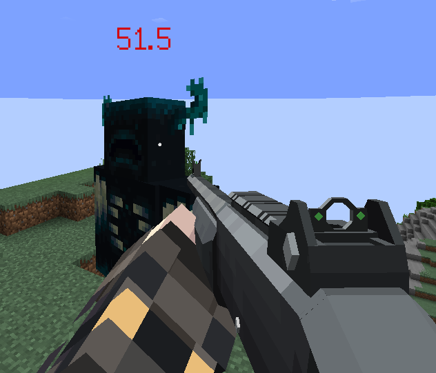
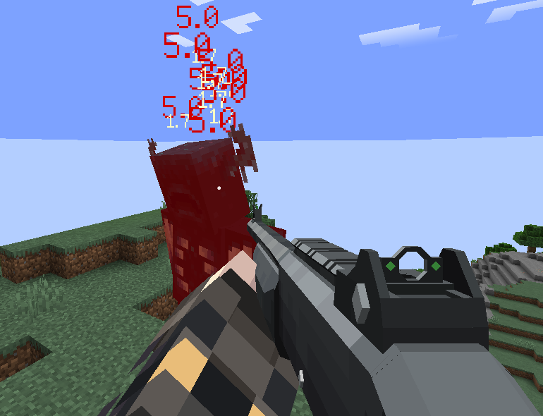

# Show Damage (伤害数字显示)
---

一个简易的 Minecraft 1.20.1 Forge **客户端模组**，旨在为玩家提供直观的伤害数字视觉反馈。
通过配置文件，您可以高度自定义以下内容：
-  **颜色与大小**：调整数字的显示样式。
-  **物理效果**：自定义重力、初速度和持续时间。
-  **伤害合并模式**：选择是否将短时间内多次伤害合并显示。

A simple Minecraft 1.20.1 Forge **client-side mod** designed to provide intuitive visual feedback with floating damage numbers.
The configuration file allows for extensive customization of:
-  **Colors & Sizes**: Adjust the visual style of the numbers.
-  **Physics Effects**: Customize gravity, initial velocity, and lifetime.
-  **Accumulation Mode**: Toggle whether to stack multiple hits into a single number.

---

## 📸 截图 / Screenshots

---

## 📥 下载 / Download

您可以从 Modrinth 或 CurseForge 下载最新版本的模组。

*You can download the latest version of the mod from Modrinth or CurseForge.*

<!-- 请将下方的 # 替换为您实际的模组页面链接 -->
<!-- Replace '#' below with your actual mod page links -->

---

> ⚠️ **注意 / Note**: 
> - 此模组仅为 **客户端 (Client-side)** 有效。安装在服务器上不保证生效。
> - This mod is **Client-side Only**. Installing it on a server may not function as intended.
> - 需要安装 **Cloth Config API** 才能运行配置界面。
> - **Cloth Config API** is required to access the in-game configuration screen.

## 作者 / Author
Made with ❤ by zzdzt
